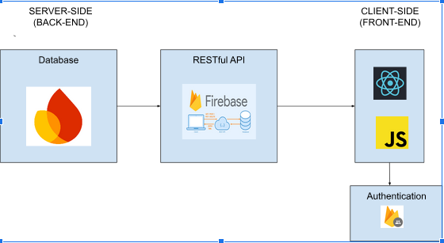

# NextTalk Chat App

> **NOTE**: 08-10-2024

> I developed NextTalk independently as a personal project to enhance my skills in React and Firebase. This master branch features the current version, which is fully functional and ready for use.

---

## Description 💬

NextTalk is a real-time chat application that allows users to communicate seamlessly. It provides a platform for instant messaging, enhancing social interactions online.

## Table of Contents

- [Features](#features)
- [Medium Blog Posts](#medium-blog-posts)
- [Tech Stack](#tech-stack)
- [Installation](#installation)
- [Usage](#usage)
- [Authentication](#authentication)
- [Contributing](#contributing)
- [License](#license)
- [External Resources](#external-resources)

## Features 🌟

- **Real-time Messaging:** Instant messaging capabilities for seamless communication.
- **User Authentication:** Secure sign-up and login process using Firebase Authentication.
- **Responsive Design:** Works well on both desktop and mobile devices.
- **User Profiles:** Create and manage user profiles with ease.
- **Chat History:** Access previous chats and messages for reference.
- **Notifications:** Real-time notifications for new messages.

## Medium Blog Posts 📰

For understanding of NextTalk Chat App, along with an overview of its tech stack and development process, I have written an article on Medium. You can read it through the links below:

+ [Introducing NextTalk Chat App - A Chat Application with Real-Time Support](https://medium.com/@cityalight.hesbon/introducing-nexttalk-chat-app-a-chat-application-with-real-time-support-d7446e71587a)


## Tech Stack 🐩



### Backend:

- **Firebase:** Provides backend services including authentication and real-time database capabilities through a RESTful API.

### Frontend:

- **React:** A JavaScript library for building user interfaces.
- **JavaScript:** The primary programming language used for frontend development.
- **Firebase Authentication:** Used for secure user authentication and management.

### Additional Libraries:

- **React Router:** For handling routing in the application.
- **Styled Components:** For styling components in a modular way.

## Installation ⚙️

Follow these steps to get your local copy up and running:

1. **Clone the repository:**
   ```bash
   git clone https://github.com/Heshbon/nexttalk-chat-app

2. Navigate to the project directory:
    ```bash
    cd nexttalk chat-app

3. Install dependencies:
    ```bash
    npm install

4. Install Firebase:
    ```bash
    npm install firebase

5. Create a .env file

+ Set up your Firebase configuration in a .env file at the root of your project.

+ Example:

REACT_APP_FIREBASE_API_KEY=your_api_key
REACT_APP_FIREBASE_AUTH_DOMAIN=your_auth_domain
REACT_APP_FIREBASE_PROJECT_ID=your_project_id
REACT_APP_FIREBASE_STORAGE_BUCKET=your_storage_bucket
REACT_APP_FIREBASE_MESSAGING_SENDER_ID=your_sender_id
REACT_APP_FIREBASE_APP_ID=your_app_id

6. Start the development server:
    ```bash
    npm run dev

## Usage 🚀

1. Access the application: Open your browser and navigate to http://localhost:5173/.

2. Register/Login: Use the registration form to create a new user or log in with existing credentials.

3. Explore Features:

    + Chat: Start chatting with friends in real-time.

    + Profile Management: Update your user profile and settings.
    
    + Notifications: Stay updated with notifications for new messages.

## Authentication 🔑

<div align="center">
    
</div>


Passwords are no fun. NextTalk features a user authentication process managed by Firebase Authentication. The process works as follows:

1. **User Input**: The user enters their email (for login) or both email and username (for signup). The front-end initially sends the email/username to the back-end.

2. **Login Check**: If logging in, and an account does not exist with the given email, the back-end returns a redirect code, and the user is directed to the sign-up process. Otherwise, the back-end generates and returns a challenge token associated with the email.

3. **Send Login Email**: The front-end temporarily stores the challenge token in `localStorage` and uses the Firebase API to send a login email to the user. The login email includes a random code that the user must enter to verify their account.

4. **Verification**: Upon entering the verification code, the user is redirected to the home page of NextTalk. This redirect occurs on a URL hashed by Firebase, which the front-end parses to retrieve the user's profile.

5. **Token Exchange**: The front-end retrieves the challenge token from `localStorage` and returns it to the back-end along with the verified email. The back-end generates and returns a bearer token in the form of a cookie.

6. **Cleanup**: After being returned to the back-end, the challenge token is cleared from `localStorage`. The bearer token is set, and the user can fully access their profile!

This passwordless approach enhances user experience by simplifying the authentication process while ensuring security through Firebase Authentication.

## Contributing 🤝

Contributions are welcome! Please follow these steps to contribute:

1. Fork the repository.

2. Create a new branch:
    ```bash
    git checkout -b feature/YourFeature

3. Make your changes and commit:
    ```bash
    git commit -am 'Add some feature'

4. Push to the branch:
    ```bash
    git push origin feature/YourFeature

5. Create a new Pull Request.

## Author ✒️

+ Hesbon Kipchirchir [Heshbon](https://github.com/Heshbon)

## License 🔒

+  This project is licensed under the [MIT License](https://opensource.org/licenses/MIT) - see the [LICENSE](https://github.com/Heshbon/nexttalk-chat-app/blob/main/LICENSE) file for details.

## External Resources 📚

For more inspiration on writing a good README, check out these resources:

- [Awesome README](https://github.com/matiassingers/awesome-readme)

- [How to Write a Good README?](https://www.makeareadme.com/)
